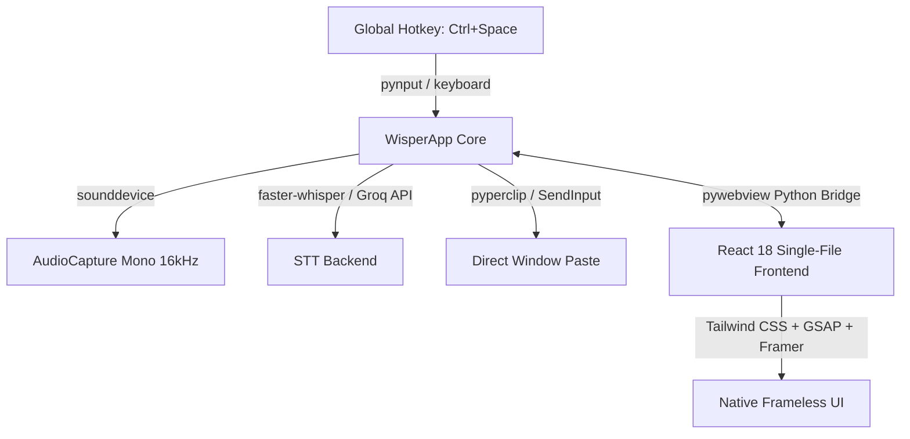

<p align="center">
  
</p>

<p align="center">
  <strong>Think it. Say it. Done.</strong><br>
  A blisteringly fast, privacy-first Windows desktop speech-to-text dictation application.
</p>

<p align="center">
  
  
  
  
  
  
</p>

---

## Overview

**Say It** (formerly *Wisper*) is a standalone Windows desktop dictation app built for flow state. Tap a global hotkey anywhere in Windows (`Ctrl+Space`), speak naturally, and watch your spoken words instantly transcribed, formatted, and pasted directly into your active window—VS Code, Slack, Notion, Obsidian, Word, or any browser.

<p align="center">
  
</p>

---

## ✨ Key Features

- 🎙️ **Universal Global Hotkey:** Press `Ctrl+Space` (or your custom combination) anywhere in Windows to trigger listening. Press again to transcribe and auto-paste directly into your focused application.
- 🔒 **100% Offline & Private:** Powered by `faster-whisper` (CTranslate2) running locally on your CPU or NVIDIA CUDA GPU. Zero telemetry, zero external web dependencies, and zero data leaving your machine.
- ⚡ **Ultra-Fast Cloud Engine (Optional):** Optional integration with the Groq Whisper API (`whisper-large-v3-turbo` / `whisper-large-v3`) delivering sub-350ms dictation speeds for rapid work.
- 🧼 **Smart Cleanup Profiles:** Choose how your text is handled:
  - **Light:** Clean punctuation and capitalization without modifying your vocabulary.
  - **Casual:** Smooth natural phrasing.
  - **Formal:** Professional grammar and punctuation suitable for client emails and documents.
  - **Structured:** Formats stream-of-consciousness thoughts into concise bullet points.
  - **Raw:** Exact verbatim transcription output.
- 🪟 **Floating MiniBar Mode:** Compact always-on-top pill window with a live audio level meter that collapses out of your way while you work.
- 📜 **Transcription History:** Local searchable history with timestamps, single-click copy, and individual or bulk cleanup.
- 🎚️ **Live Microphone Metering:** Real-time WASAPI input device selection, volume level meter, and interactive test previews.
- 🔊 **Audio Haptic Feedback:** High-fidelity subtle acoustic cues for start, stop, paste, and cancellation states.
- 🚀 **Windows Native Integration:** Tray icon minimization, launch at Windows startup, and frameless window controls.

---

## 🛠️ Architecture & Tech Stack



- **Backend:** Python 3.12, `pywebview` (Edge WebView2 Chromium runtime), `pythonnet` / `clr_loader` (WinForms native DWM interop), `sounddevice` (WASAPI audio capture), `faster-whisper` (CTranslate2).
- **Frontend:** React 18, TypeScript, Vite 6, Tailwind CSS, Lucide Icons, SingleFile bundle (zero local server overhead).
- **Packaging:** PyInstaller 6 with full native Windows runtime dependency harvesting.

---

## 🚀 Quick Start (Development)

### Prerequisites

- **OS:** Windows 10 or Windows 11 (64-bit)
- **Python:** 3.10+ (Python 3.12 recommended)
- **Node.js:** 18+ and `npm`
- **Optional for GPU Acceleration:** NVIDIA GPU with CUDA 12 and cuDNN

### Setup Instructions

1. **Clone the repository:**
   ```bash
   git clone https://github.com/ShashankH1323/SayiT.git
   cd SayiT
   ```

2. **Set up Python Virtual Environment:**
   ```powershell
   python -m venv .venv
   .\.venv\Scripts\activate
   pip install -r requirements.txt
   ```

3. **Install Frontend Dependencies & Build:**
   ```powershell
   npm install
   npm run build
   ```

4. **Run Say It in Development Mode:**
   ```powershell
   python run_app.py
   ```

---

## 📦 Building the Standalone Executable

To compile a standalone, single-folder Windows executable that requires no Python or Node.js installation:

```powershell
npm run build:exe
```

This automated pipeline:
1. Compiles the React frontend into an inlined `dist/index.html`.
2. Generates multi-resolution icon assets (`say_it.ico`).
3. Packages the native application using PyInstaller into `release/SayIt/SayIt.exe`.
4. Produces a compressed distribution archive ready for release (`release/SayIt-v1.0.0-windows-x64.zip`).

---

## ⚙️ Configuration

Say It stores user preferences locally in `%APPDATA%\SayIt\config.json`. Key settings can also be modified in the in-app Settings panels:

| Key | Description | Default |
|---|---|---|
| `hotkey` | Global activation key combination | `ctrl+space` |
| `stt_provider` | Active speech engine (`none`, `local`, `groq`) | `none` |
| `model` | Local Whisper model (`tiny`, `base`, `small`, `medium`, `large-v3-turbo`) | `base` |
| `cleanup_mode` | Text formatting filter (`light`, `casual`, `formal`, `structured`, `raw`) | `light` |
| `paste_mode` | Injection mechanism (`auto`, `ctrl_v`, `ctrl_shift_v`, `off`) | `auto` |
| `sound_effects` | Audio cues for record/stop/paste | `true` |
| `show_minibar` | Enable compact floating minibar mode | `true` |
| `launch_at_login` | Run automatically on Windows startup | `false` |

---

## 🧪 Running Tests

The test suite validates audio capture, STT backend fallbacks, clipboard injection, and the Python-to-Webview bridge:

```powershell
.\.venv\Scripts\pytest.exe
```

---

## 📄 License

Distributed under the MIT License. See `LICENSE` for details.
