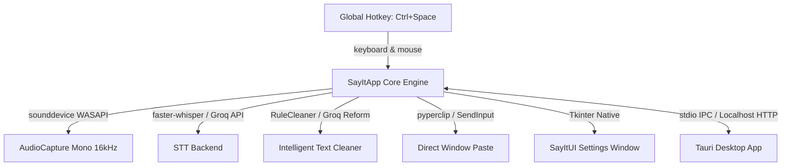

# Say It

<p align="center">
  <strong>Think it. Say it. Done.</strong><br>
  A blisteringly fast, privacy-first Windows desktop speech-to-text dictation application.
</p>

<p align="center">
  
  
  
  
  
</p>

---

## Overview

**Say It** is a standalone Windows desktop dictation app built for peak flow state. Tap a global hotkey anywhere in Windows (`Ctrl+Space`), speak naturally, and watch your spoken words instantly transcribed, formatted, and pasted directly into your active window—VS Code, Slack, Notion, Obsidian, Word, or any browser.

The core backend is ultra-lean, robust, and designed to support **Tauri** with zero dependency on PyWebView:
- **Zero WebView2 / PyWebView bugs:** Pure Python backend core with native Settings & Dictation window.
- **Tauri Integration Ready:** Built-in stdio JSON-RPC IPC sidecar mode (`--tauri-ipc`) and localhost HTTP REST API with CORS (`--server`).
- **Maximum Speed:** Cloud Groq transcription (~300ms) with persistent keep-alive sessions, plus local on-device `faster-whisper` (CTranslate2) with greedy beam-1 search.

---

## ✨ Key Features

- 🎙️ **Universal Global Hotkey:** Press `Ctrl+Space` (or your custom combination) anywhere in Windows to trigger listening. Press again to transcribe and auto-paste directly into your focused application.
- ⚡ **Ultra-Fast Cloud Engine:** Optional integration with the Groq Whisper API (`whisper-large-v3-turbo` / `whisper-large-v3`) delivering sub-350ms dictation speeds for rapid work.
- 🔒 **100% Offline & Private (Local Mode):** Powered by `faster-whisper` (CTranslate2) running locally on your CPU or NVIDIA CUDA GPU. Zero telemetry and zero data leaving your machine.
- 🧼 **Smart Cleanup Profiles:** Choose how your text is handled:
  - **Light:** Clean punctuation, disfluency removal, and capitalization without modifying your vocabulary.
  - **Casual:** Smooth natural phrasing.
  - **Formal:** Professional grammar and punctuation suitable for client emails and documents.
  - **Structured:** Formats stream-of-consciousness thoughts into concise bullet points.
  - **Raw:** Exact verbatim transcription output.
- 📜 **Transcription History:** Local searchable history with timestamps, single-click copy, and individual or bulk cleanup.
- 🎚️ **Live Microphone Metering:** Real-time WASAPI input device selection, volume level meter, and interactive test previews.
- 🔊 **Audio Haptic Feedback:** High-fidelity subtle acoustic cues for start, stop, paste, and cancellation states.
- 🦀 **Tauri Ready:** Fully prepared for the Tauri frontend rebuild via sidecar stdio IPC or local REST server.

---

## 🛠️ Architecture



- **Core Engine:** Python 3.11/3.12, `sounddevice` (WASAPI shared audio capture), `faster-whisper` (CTranslate2), `httpx` (keep-alive Groq API), `keyboard` & `mouse` (global hotkeys).
- **Settings UI:** Lightweight, native Tkinter window (`sayit.ui.SayItUI`) displaying all required settings, live mic meters, and history.
- **Tauri Bridge:** `sayit.tauri.SayItBridge` providing stdio JSON-lines sidecar IPC and local HTTP server (`http://127.0.0.1:47888`).

---

## 🚀 Quick Start

### Setup Instructions

1. **Clone the repository:**
   ```bash
   git clone https://github.com/ShashankH1323/SayiT.git
   cd SayiT
   ```

2. **Set up Python Virtual Environment:**
   ```powershell
   python -m venv .venv
   .\.venv\Scripts\activate
   pip install -r requirements.txt
   ```

3. **Configure API Key (Optional for Cloud STT):**
   Add your Groq API key in `.env`:
   ```env
   GROQ_API_KEY=gsk_...
   ```

4. **Run Say It:**
   - **Default (Native Settings Window + Dictation Hotkey):**
     ```powershell
     python run_app.py
     # or
     .\run_sayit.bat
     # or
     python -m sayit
     ```
   - **Tauri HTTP REST Server Mode:**
     ```powershell
     python -m sayit --server --port 47888
     ```
   - **Tauri Sidecar Stdio IPC Mode:**
     ```powershell
     python -m sayit --tauri-ipc
     ```
   - **Headless Mode (Background hotkey only):**
     ```powershell
     python -m sayit --headless
     ```

---

## ⚙️ Configuration

Say It stores user preferences locally in `config.json` (or `%APPDATA%\SayIt\config.json`). Key settings can be configured via the UI or `config.json`:

| Key | Description | Default |
|---|---|---|
| `hotkey` | Global activation key combination | `ctrl+space` |
| `stt_provider` | Active speech engine (`groq`, `local`) | `groq` |
| `groq_model` | Groq cloud model (`whisper-large-v3-turbo`, `whisper-large-v3`) | `whisper-large-v3-turbo` |
| `model` | Local model (`tiny`, `base`, `small`, `medium`, `large-v3-turbo`) | `base` |
| `cleanup_mode` | Text formatting filter (`light`, `casual`, `formal`, `structured`, `raw`) | `light` |
| `paste_mode` | Injection mechanism (`auto`, `ctrl_v`, `ctrl_shift_v`) | `auto` |
| `sound_effects` | Audio cues for record/stop/paste/cancel | `true` |
| `noise_suppression` | Pre-STT amplitude noise gate | `false` |
| `input_threshold` | Silence gate threshold (0 = disabled) | `0.0` |

---

## 🧪 Running Tests

The test suite validates audio capture, STT backends, clipboard injection, text cleaning, tactile sound synthesis, and the Tauri IPC bridge:

```powershell
.\.venv\Scripts\pytest.exe
```

All 29 tests run in under 0.5s!

---

## 📄 License

Distributed under the MIT License.
